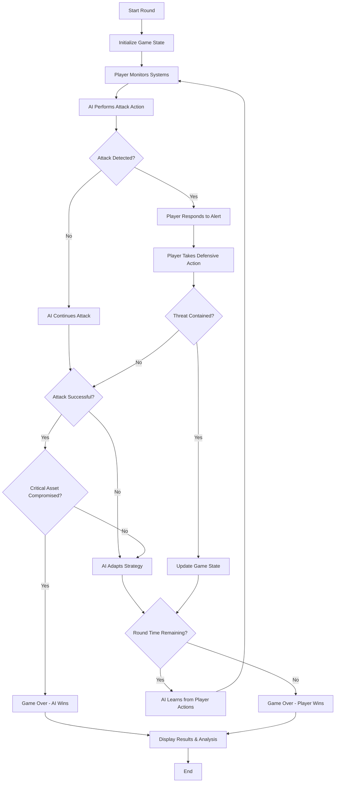

## Blue Team vs Red Team Mode Ideas

### 1. Overview
This game mode immerses the player as the Blue Team (defender) tasked with protecting a digital environment, while the Red Team (attacker) is powered by an adaptive AI. The Red Team AI uses reinforcement learning algorithms (such as Q-learning or Deep Q-Networks) to evolve its attack strategies in response to the player's defensive actions.

### 2. Objectives
- **Blue Team (Player):** Safeguard assets, detect and respond to intrusions, and mitigate threats.
- **Red Team (AI):** Breach defenses, exploit vulnerabilities, and achieve specific attack goals.

### 3. Core Mechanics
- Dynamic attack/defense scenario played in a single round.
- AI adapts its tactics using reinforcement learning, becoming more sophisticated as the player improves.
- Player receives actionable feedback and analytics to refine their defense strategies.

### 4. Reinforcement Learning Implementation
- **Q-learning:** Tabular approach for simple environments, tracking state-action values.
- **DQN:** Neural network-based approach for complex environments, enabling the AI to generalize across states.
- **Reward System:** AI is rewarded for successful attacks and penalized for detection or failed attempts.
- **State Space:** Considers network topology, asset status, player actions, and alert levels.

### 5. Scenario: Defending Project Sentinel Academy
In this simulation, the player is the lead defender for Project Sentinel Academy, a fictional institution specializing in cybersecurity education and research. The AI Red Team launches coordinated attacks mapped to MITRE ATT&CK tactics and techniques, attempting to compromise the academy's digital infrastructure.

#### Player Objectives
- Monitor network activity and system logs for signs of intrusion.
- Respond to alerts and incidents in real time.
- Implement and adjust security controls (firewalls, access policies, endpoint protection).
- Investigate suspicious behavior and contain breaches.
- Maintain the integrity and availability of critical academy resources (student data, research files, learning platforms).

#### AI Attack Strategies
- Reconnaissance: Scan the academy's network for vulnerabilities and gather information about users and systems.
- Initial Access: Attempt phishing campaigns targeting staff and students, exploit public-facing applications, or use stolen credentials.
- Lateral Movement: Move through the network to access sensitive research data or administrative systems.
- Persistence & Evasion: Deploy malware that maintains access and avoids detection, using advanced defense evasion techniques.
- Impact: Disrupt academy operations, exfiltrate confidential data, or attempt to deface public-facing websites.

#### Simulation Features
- Dynamic attack scenario that evolves as the AI learns from the player's defenses.
- Real-time feedback and analytics on defense effectiveness.
- Replay and analysis tools to review both successful and unsuccessful defense actions.
- Difficulty scaling based on player performance and AI adaptation.

This scenario provides a realistic, standards-based training environment for players to practice defending against sophisticated, adaptive cyber threats in a high-stakes setting.

#### Victory and Loss Conditions
- **Victory:** The player successfully prevents the AI from achieving its attack objectives (e.g., no critical assets are compromised, no data is exfiltrated, and academy operations remain uninterrupted) by the end of the round.
- **Loss:** The AI successfully compromises critical assets, exfiltrates sensitive data, or disrupts academy operations before the round ends.

### 6. Progression & Adaptation
- The AI learns from each round, improving its attack strategies.
- The player faces increasingly sophisticated attacks as the AI adapts.

### 7. Potential Features
- Replay analysis: Review AI attack paths and player responses.
- Difficulty scaling: Adjust RL parameters for beginner/expert modes.
- Leaderboards for defense effectiveness.

### 8. Alignment with MITRE ATT&CK & ISO 27001

#### MITRE ATT&CK Tactics
MITRE ATT&CK tactics represent specific adversarial goals: what attackers want to accomplish at each stage of a cyberattack. These tactics correspond to phases such as:

- **Reconnaissance:** Gathering information for planning an attack.
- **Resource Development:** Establishing resources to support attack operations.
- **Initial Access:** Penetrating the target system or network.
- **Execution:** Running malware or malicious code on the compromised system.
- **Persistence:** Maintaining access to the compromised system (in the event of shutdown or reconfigurations).
- **Privilege Escalation:** Gaining higher-level access or permissions (e.g., moving from user to administrator access).
- **Defense Evasion:** Avoiding detection once inside a system.
- **Credential Access:** Stealing usernames, passwords, and other logon credentials.
- **Discovery:** Researching the target environment to learn what resources can be accessed or controlled to support a planned attack.
- **Lateral Movement:** Gaining access to additional resources within the system.
- **Collection:** Gathering data related to the attack goal (e.g., data to encrypt and/or exfiltrate as part of a ransomware attack).
- **Command and Control:** Establishing covert/undetectable communications that enable the attacker to control the system.
- **Exfiltration:** Stealing data from the system.
- **Impact:** Interrupting, corrupting, disabling, or destroying data or business processes.

Tactics and techniques vary by matrix. For example, the Mobile Matrix omits Reconnaissance and Resource Development, but includes Network Effects and Remote Service Effects not found in the Enterprise Matrix.

#### ISO 27001 Alignment
ISO 27001 provides a framework for information security management systems (ISMS). Game scenarios can be mapped to ISO 27001 controls, such as:
- **Access Control:** Preventing unauthorized access (aligns with Initial Access, Privilege Escalation).
- **Incident Response:** Detecting and responding to security incidents (aligns with Defense Evasion, Impact).
- **Asset Management:** Protecting critical assets (aligns with Collection, Exfiltration).
- **Communications Security:** Securing network communications (aligns with Command and Control).
- **Operations Security:** Monitoring and maintaining secure operations (aligns with Persistence, Discovery).

By aligning attacks and defenses with MITRE ATT&CK tactics and ISO 27001 controls, the game mode provides realistic, standards-based scenarios for both the AI and the player.

### 9. MITRE ATT&CK Techniques by Tactic
The table below summarizes the number of techniques associated with each MITRE ATT&CK tactic, along with representative examples:

| Tactic                | # Techniques | Example Techniques |
|-----------------------|-------------|-------------------|
| Reconnaissance        | 10          | Active Scanning, Gather Victim Host Information, Phishing for Information |
| Resource Development  | 8           | Acquire Infrastructure, Compromise Accounts, Develop Capabilities |
| Initial Access        | 11          | Drive-by Compromise, Exploit Public-Facing Application, Phishing |
| Execution             | 16          | Command and Scripting Interpreter, User Execution, Scheduled Task/Job |
| Persistence           | 23          | Boot or Logon Autostart Execution, Create Account, Hijack Execution Flow |
| Privilege Escalation  | 14          | Abuse Elevation Control Mechanism, Access Token Manipulation, Process Injection |
| Defense Evasion       | 45          | Deobfuscate/Decode Files, Hide Artifacts, Impair Defenses, Masquerading |
| Credential Access     | 17          | Brute Force, Credentials from Password Stores, OS Credential Dumping |
| Discovery             | 33          | Account Discovery, File and Directory Discovery, Network Service Discovery |
| Lateral Movement      | 9           | Exploitation of Remote Services, Lateral Tool Transfer, Remote Service Session Hijacking |
| Collection            | 17          | Archive Collected Data, Audio Capture, Email Collection, Screen Capture |
| Command and Control   | 18          | Application Layer Protocol, Encrypted Channel, Proxy, Remote Access Tools |
| Exfiltration          | 9           | Automated Exfiltration, Exfiltration Over Web Service, Scheduled Transfer |
| Impact                | 15          | Data Destruction, Defacement, Disk Wipe, Endpoint Denial of Service |

Each technique may have subtechniques. For example, Phishing includes spear phishing attachment, spear phishing link, and spear phishing via service. The MITRE ATT&CK knowledge base documents 196 individual techniques and 411 subtechniques.

Incorporating these techniques and their subtechniques into the game mode allows for a rich variety of attack and defense scenarios, closely mirroring real-world adversarial behavior.

### 10. MITRE ATT&CK Techniques
If MITRE ATT&CK tactics represent what attackers want to accomplish, MITRE ATT&CK techniques represent how they try to accomplish it. For example, drive-by compromise and spear phishing are types of initial access techniques; using fileless storage is an example of a defense evasion technique.

The MITRE ATT&CK knowledge base provides the following information for each technique:
- **Description and Overview:** Each technique is documented with a summary of how it works and its role in cyberattacks.
- **Subtechniques:** Many techniques have subtechniques that detail specific methods. For example, phishing includes spear phishing attachment, spear phishing link, and spear phishing via service. As of now, MITRE ATT&CK documents 196 individual techniques and 411 subtechniques.
- **Related Procedures:** Examples of how attack groups use the technique, or types of malware that employ it.
- **Mitigations:** Security practices (e.g., user training) or software (e.g., antivirus, intrusion prevention systems) that can block or address the technique.
- **Detection Methods:** Log data or system data sources that security teams or security software can monitor for evidence of the technique.

Incorporating these techniques and their details into the game mode will allow for realistic simulation of attacker behavior and defender responses, enhancing both gameplay and educational value.

### 11. Gameplay Loop Flowchart

Below is a Mermaid.js flowchart representing the gameplay loop for the Blue Team vs Red Team simulation:

---

## References

- MITRE ATT&CK framework for attack techniques
- ISO 27001 for security controls and best practices
- OpenAI Gym for RL environments
- Papers on RL for cybersecurity (e.g., "Reinforcement Learning for Cybersecurity" by Alrawais et al.)